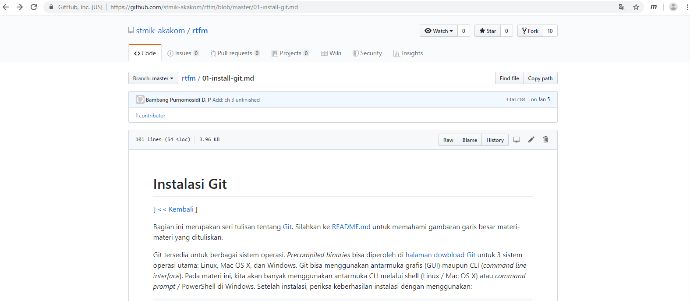
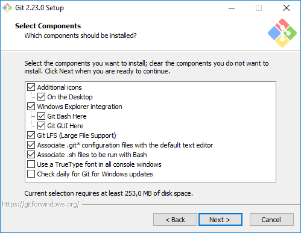
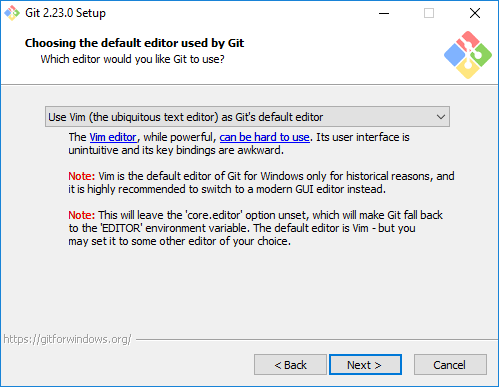
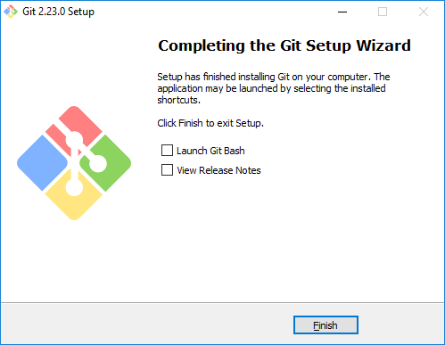

# Pertemuan 01 Instalasi Git

1. Langkah pertama download melalui link https://github.com/stmik-akakom/rtfm.

2. Buka file yang telah di download. Lalu klik Next.
   
   

3. Tidak ada yang perlu dirubah, sesuai default lalu klik Next.
    
   
4. Pilih Notepad++ untuk editornya bersama dengan Git. Lalu klik Next.
   
   
5. Pilih Git from the Windows Command Prompt supaya bisa menggunakan dari dua antarmuka tersebut akses git melalui Bash maupun command prompt.
   
   
   
6. Pilih Usethe OpenSSL library, lalu klik Next.
   
   

7. Pilih Checkout the line ending conversions, lalu klik Next.  
   
   
8. Pilih Usethe OpenSSL library, lalu klik Next.Use MinTTY (the default terminal of MSYS2), lalu klik Next.
   
   
9. Biarkan sesuai default, lalu klik Next.
   
   
   
10. Lalu klik Install.
   
    
	
11. Tunggu sampai proses install selesai.
   
    
	
12. Jika sudah selesai klik Finish.
   
    
	
13. Untuk membuka aplikasi Git Bash, klik Start ketikkan Git.
   
    
	
14. Berikut tampilan aplikasi Git Bashnya.
   
    