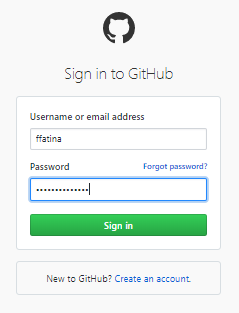

# Pertemuan 02 Git untuk Kolaborasi

Selain untuk mengelola aset digital milik diri sendiri, kita bisa menggunakan Git untuk berkolaborasi dalam suatu repo di GitHub yang bisa diakses bersama.
Dalam kasus seperti ini, berarti ada 2 peran:
Pemilik repo, sering disebut sebagai upstream author.
Kontributor, yaitu orang-orang yang akan berkontribusi memberikan konten.

A. FORK
   Fork adalah membuat clone dari suatu repo di GitHub milik upstream author, diletakkan ke milik kontributor.
   Fork hanya dilakukan sekali saja. Pada dasarnya, proses untuk fork ini meliputi:
   1. Fork repo di web GitHub.
   2. Clone fork tersebut di komputer lokal.
   
   Kontributor harus mem-fork repo upstream author sehingga di repo kontributor muncul repo tersebut.
   Proses forking ini dijelaskan dengan langkah-langkah berikut:
   1. Login ke GitHub
      
   2. Akses repo yang akan di-fork: https://github.com/ffatina/playground
   3. Pada sisi kanan atas, klik Fork:
      