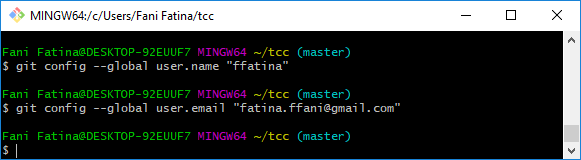
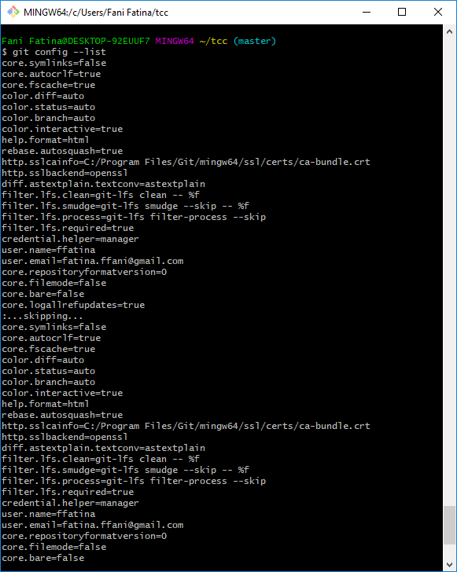

# Pertemuan 02 Konfigurasi Git

1. Ada beberapa konfigurasi yang harus dupersiapakan sebelum mulai menggunakan Git, seperti name dan email.

2. Isian di atas harus disesuaikan dengan nama serta email yang digunakan untuk mendaftar di GitHub. Untuk melihat konfigurasi yang sudah ada:

