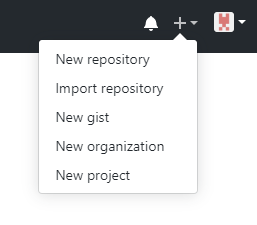
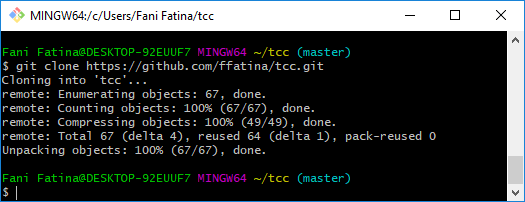
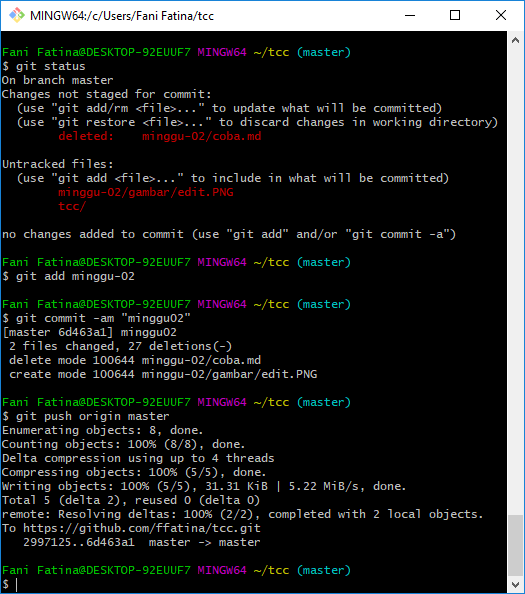
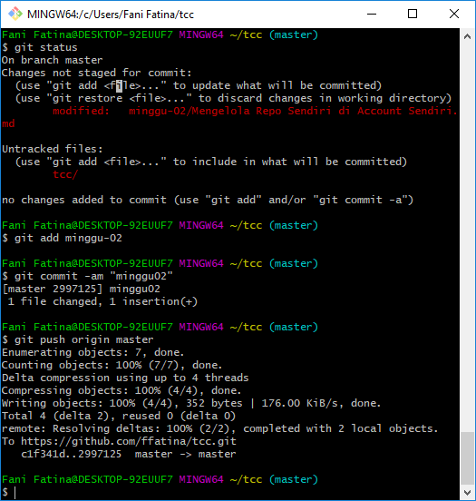
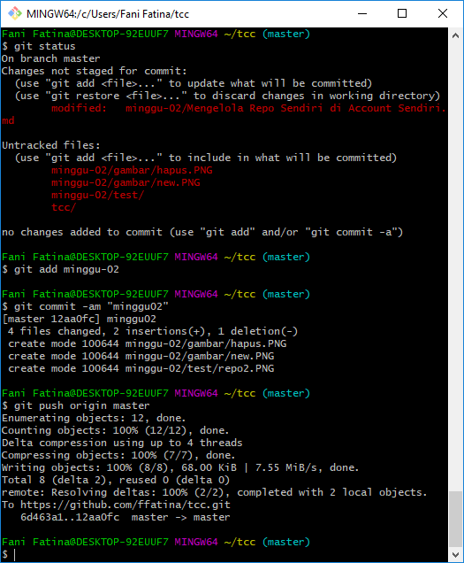
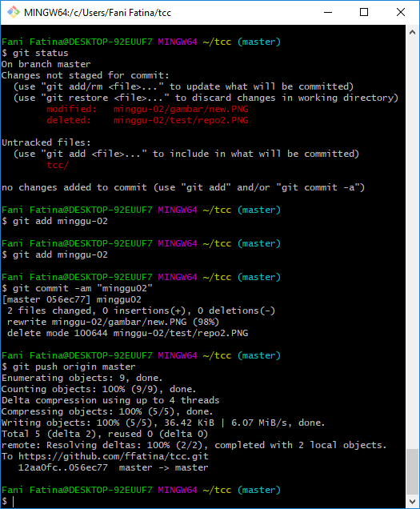

# Pertemuan 02 Mengelola Repo Sendiri di Account Sendiri

Membuat Repo
1. Klik tanda + pada bagian atas setelah login, pilih New repository. Letaknya ada di pojok kanan atas.

2. Isi nama, deskripsi lalu pilih yang Public. Jika sudah klik "Create repository".

Clone Repo
Clone repo berfungsi untuk menduplikasi remote repo di Github ke komputer lokal.
Perintah yang digunakan yaitu git clone https://github.com/ffatina/tcc.git

Mengelola Repo
Setelah clone ke komputer lokal, semua manipulasi konten dilakukan di komputer lokal dan hasilnya akan di-push ke remote repo di GitHub.
Dengan demikian, jangan berganti-ganti remote lokal, sekali dibuat disitu, tetap berada disitu.

Mengubah Isi - Push Tanpa Branching dan Merging
1. File dihapus

   

2. File diedit

   
   
3. Membuat file / direktori baru

   
   
4. Menghapus direktori

   