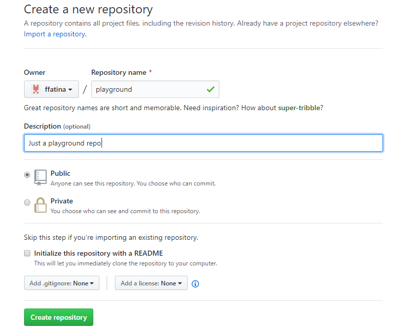

# Pertemuan 02 Mengelola Repo Sendiri di Organisasi

Repo yang dibuat bisa diletakkan pada account kita maupun berada pada suatu organisasi.
Organisasi bisa kita buat sendiri maupun kita dimasukkan menjadi anggota organisasi. 