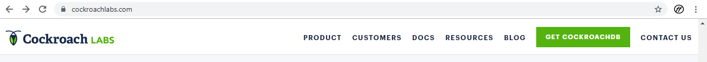
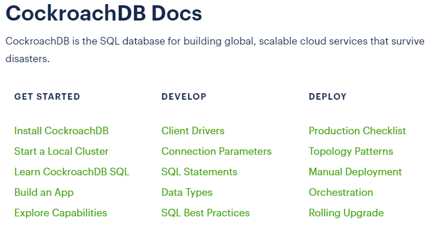
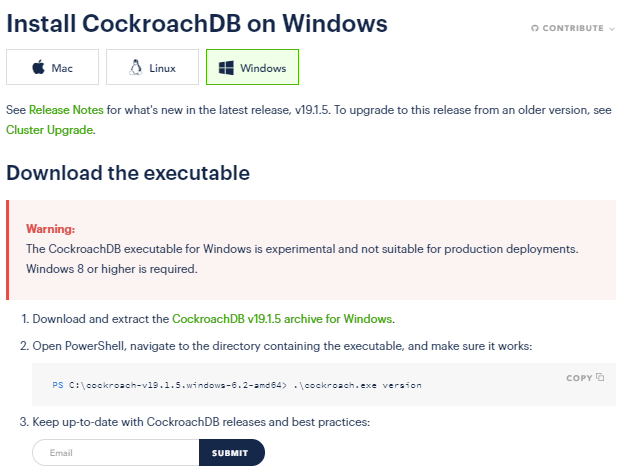
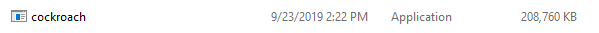
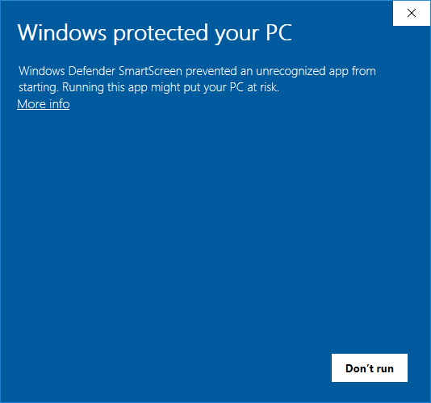
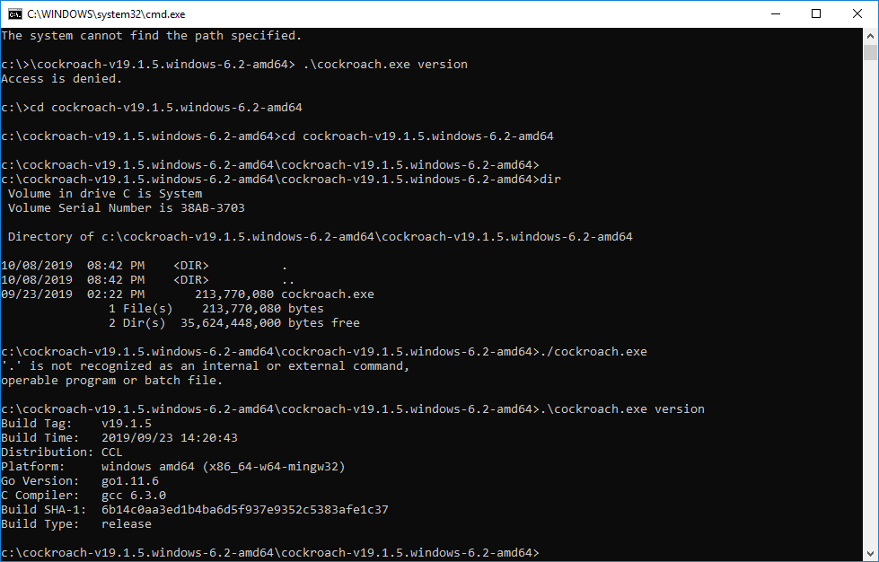

# Pertemuan 05 

# Install CockroachDB
1. Langkah pertama untuk install CockroachDB buka link berikut ini : www.cockroachlabs.com.

2. Lalu pilih menu Docs.
   

3. Pilih Install CockroachDB
   
   
4. Download sesuai OS yang digunakan.
   
   
5. Ekstrak file yang sudah terdownload.

6. Run file seperti pada gambar dibawah ini :
   
   
7. Ketika di run akan muncul gambar dibawah ini, lalu klik more info.
   
   
8. Pilih Run anyway.
   
   
9. Buka cmd dan masuk ke folder yang didownload tadi. Lalu run filenya.
   
  
 
 