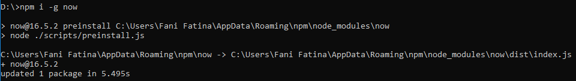
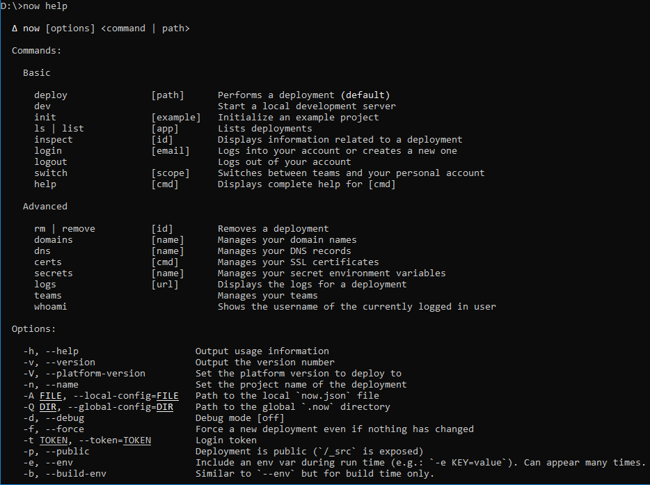
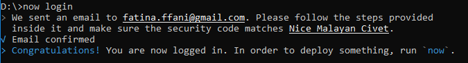
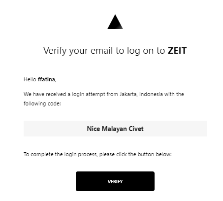

# Pertemuan 05 ZEIT

ZEIT Now adalah platform cloud untuk situs statis dan Fungsi Tanpa Server. Ini memungkinkan pengembang untuk meng-host situs web dan layanan web yang digunakan secara instan, skala secara otomatis, dan tidak memerlukan pengawasan, semua tanpa konfigurasi.

# Install Now CLI

Untuk menggunakan ZEIT Now, Anda harus menginstal Now CLI, antarmuka baris perintah yang sering diperbarui dan open-source.
Untuk mendapatkan Now CLI dari npm atau Yarn. Menggunakan npm, jalankan perintah berikut dari terminal Anda:

Untuk memverifikasi bahwa Anda telah menginstal Sekarang CLI, coba jalankan sekarang bantuan dari terminal Anda.

Dengan Sekarang CLI diinstal, Anda sekarang dapat login menggunakan perintah berikut:

Saat login terdapat langkah untuk verifikasi melalui email
