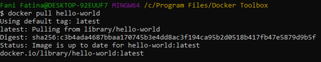
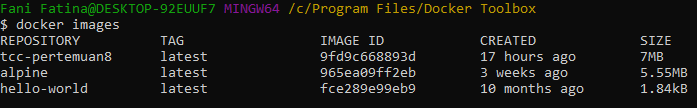

# Pertemuan 08 Docker Image

Docker images adalah sebuah template yang bersifat read only. Template ini sebenarnya adalah sebuah OS atau OS yang telah diinstall berbagai aplikasi. Docker images berfungsi untuk membuat docker container, dengan hanya 1 docker images kita dapat membuat banyak docker container.

Terdapat beberapa Image docker yang bisa kita segera gunakan. Untuk mengambil image dari lokasi docker hub memerlukan koneksi internet. 

Setelah berhasil mari kita periksa kembali apakah busybox tersebut sudah berhasil berada dalam Image docker dengan menggunakan perintah berikut ini :

