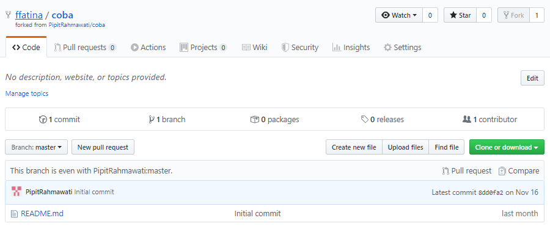
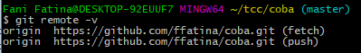
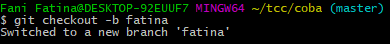
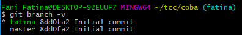

# Pertemuan 10 Kolaborasi

Clone belajarork terlebih dahulu kemudian masuk di repo tersebut

1. Login ke GitHub dan masuk ke repo fork tersebut, Pilih fork
   
   
2. Lihat repository yang ada
   
   
3. Update dari upstream ke master
4. Buat brach baru dengan nama ffatina
   
   
5. Melihat branch dan yang di commit
   
   
6. Edit readme dan menambahkan jika ada perubahan
	$ vim README.md
	$ git add . 
	

