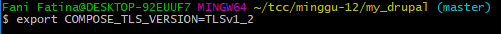

# Pertemuan 12 Install Drupal with Docker Compose

https://www.linode.com/docs/quick-answers/linux/drupal-with-docker-compose/

1. Jalankan Docker terlebih dahulu kemudian masuk ke folder project
   
   
   
2. Membuat folder dengan nama my-drupal

   
	
3. Masuk ke root folder yang di buat

   

4. Buat File dengan nama docker-compose.yml dan isikan script berikut
   

5. Jalankan Docker compose dengan perintah , sebelum menjalankan perintah Run Pasangkan ini pada command line (export COMPOSE_TLS_VERSION=TLSv1_2)

   
   
   

	-d artinya di jalankan di belakang background

